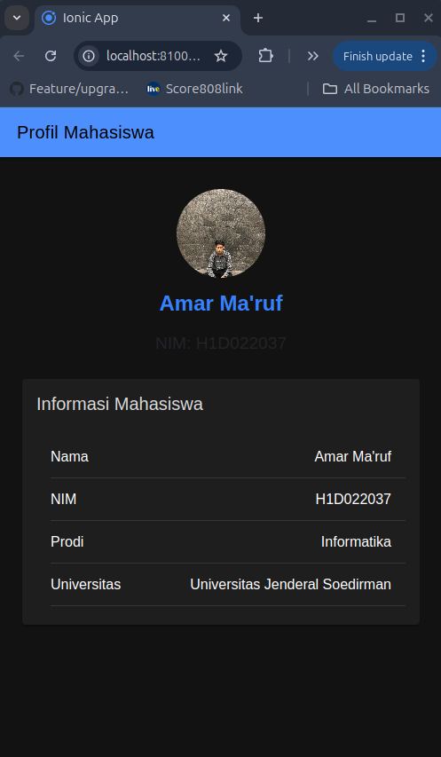

# Laporan Proyek Pembuatan Aplikasi Ionic dengan Tampilan Profil Mahasiswa

### 1. Pembuatan Proyek Baru

Pertama, buka terminal atau Command Prompt.

Jalankan perintah berikut untuk membuat proyek Ionic baru:

    ionic start tugas6 blank

- ionic start adalah perintah untuk membuat proyek baru.
- tugas6 adalah nama proyek yang dipilih untuk laporan ini.
- blank adalah template kosong yang akan digunakan untuk membuat aplikasi dari awal.
  Selama proses ini, Anda mungkin akan diminta memilih framework (Angular, React, atau Vue). Misalnya, pilih Angular jika diminta.

### 2. Menambahkan Platform Android (Opsional)

Jika aplikasi ini akan dijalankan di platform Android, tambahkan platform Android menggunakan perintah:

    ionic capacitor add android

### 3. Struktur Folder Proyek

Setelah proyek dibuat, berikut adalah struktur utama folder yang akan digunakan:

- src/app/home: Berisi komponen halaman home.
- src/assets: Berisi file aset seperti gambar atau video yang digunakan dalam proyek.
- src/global.scss: Berisi gaya global untuk aplikasi.

### 4. Menambahkan Tampilan Profil Mahasiswa

Tampilan profil mahasiswa dibuat dengan memodifikasi halaman home di dalam proyek.

Buka file src/app/home/home.page.html dan tambahkan kode HTML berikut:

    <ion-header>
      <ion-toolbar color="primary">
        <ion-title>
          Profil Mahasiswa
        </ion-title>
      </ion-toolbar>
    </ion-header>

    <ion-content class="ion-padding">
      

        <ion-avatar class="avatar">
          <!-- Masukkan foto profil di sini -->
          
        </ion-avatar>
        <h2>Amar Ma'ruf</h2>
        
NIM: 2022101234

      

      <ion-card>
        <ion-card-header>
          <ion-card-title>Informasi Mahasiswa</ion-card-title>
        </ion-card-header>
        <ion-card-content>
          <ion-list>
            <ion-item>
              <ion-label>Nama</ion-label>
              <ion-text slot="end">Amar Ma'ruf</ion-text>
            </ion-item>
            <ion-item>
              <ion-label>NIM</ion-label>
              <ion-text slot="end">2022101234</ion-text>
            </ion-item>
            <ion-item>
              <ion-label>Prodi</ion-label>
              <ion-text slot="end">Informatika</ion-text>
            </ion-item>
            <ion-item>
              <ion-label>Universitas</ion-label>
              <ion-text slot="end">Universitas Jenderal Soedirman</ion-text>
            </ion-item>
          </ion-list>
        </ion-card-content>
      </ion-card>
    </ion-content>

Penjelasan Kode:

- ion-header dan ion-toolbar: Menampilkan header dengan judul "Profil Mahasiswa."
- ion-avatar: Menampilkan foto profil menggunakan gambar yang ada di assets/images/profile.jpg.
- ion-card: Menampilkan informasi mahasiswa berupa nama, NIM, program studi, dan universitas.

### 5. Menambahkan Gaya Tampilan dengan CSS

Untuk menambahkan gaya agar tampilan lebih menarik, buka file src/app/home/home.page.scss dan tambahkan kode CSS berikut:

    .profile-card {
      display: flex;
      flex-direction: column;
      align-items: center;
      text-align: center;
      margin-top: 20px;
    }

    .avatar {
      width: 100px;
      height: 100px;
      margin-bottom: 15px;
      border-radius: 50%;
      overflow: hidden;
    }

    h2 {
      font-size: 1.5em;
      font-weight: bold;
      margin: 0;
      color: #3880ff;
    }

    p {
      font-size: 1.2em;
      color: #222428;
    }

Penjelasan CSS:

- .profile-card: Mengatur tata letak profil untuk menjadi vertikal dan rata tengah.
- .avatar: Mengatur ukuran dan bentuk avatar menjadi lingkaran.
- h2 dan p: Mengatur gaya teks nama dan NIM agar lebih besar dan menonjol.

### 6. Menambahkan Foto Profil

Letakkan foto profil Anda di folder src/assets/images dengan nama IMG_5408.HEIC.jpg. Pastikan nama file dan path sesuai dengan yang ada di kode HTML.

### 7. Menjalankan Aplikasi

Untuk melihat hasil akhirnya, jalankan aplikasi dengan perintah:

    ionic serve

Aplikasi akan terbuka di browser pada URL http://localhost:8100.
Tampilan akan menunjukkan profil mahasiswa dengan foto, nama, NIM, dan informasi lainnya sesuai kode yang telah dimasukkan.

### 8. Screenshot tampilan

